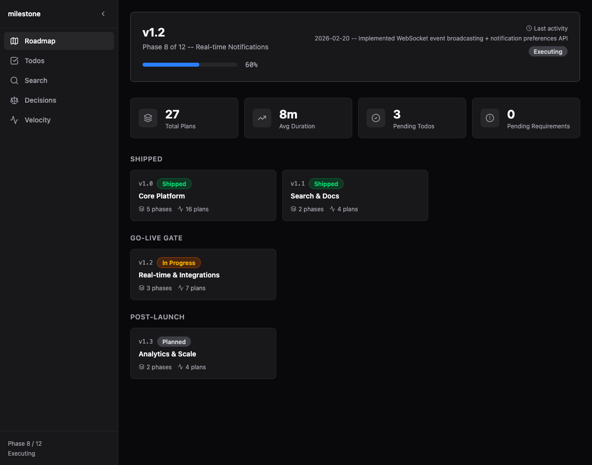
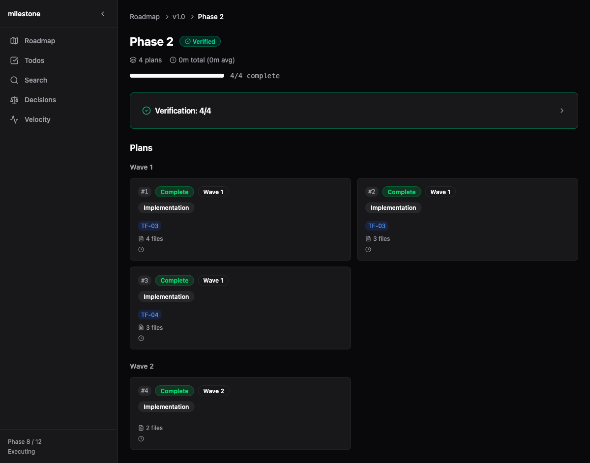
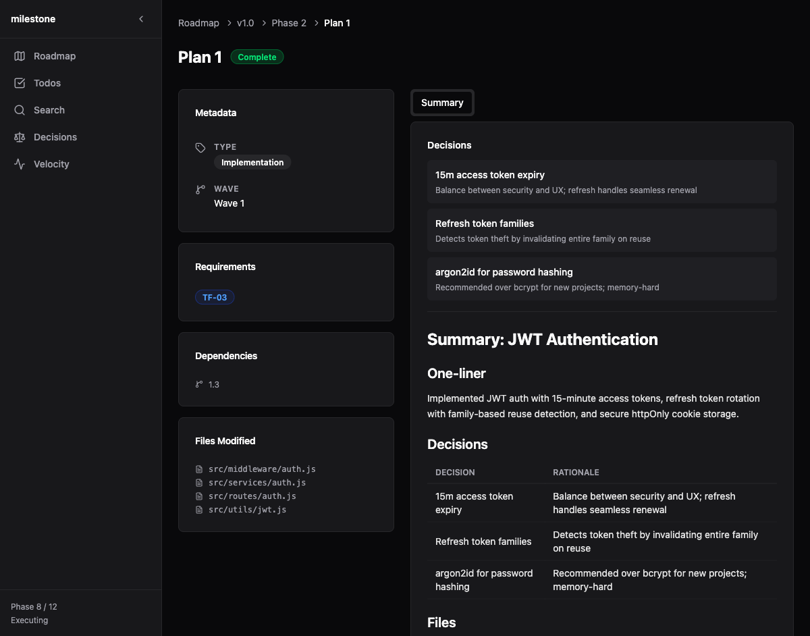
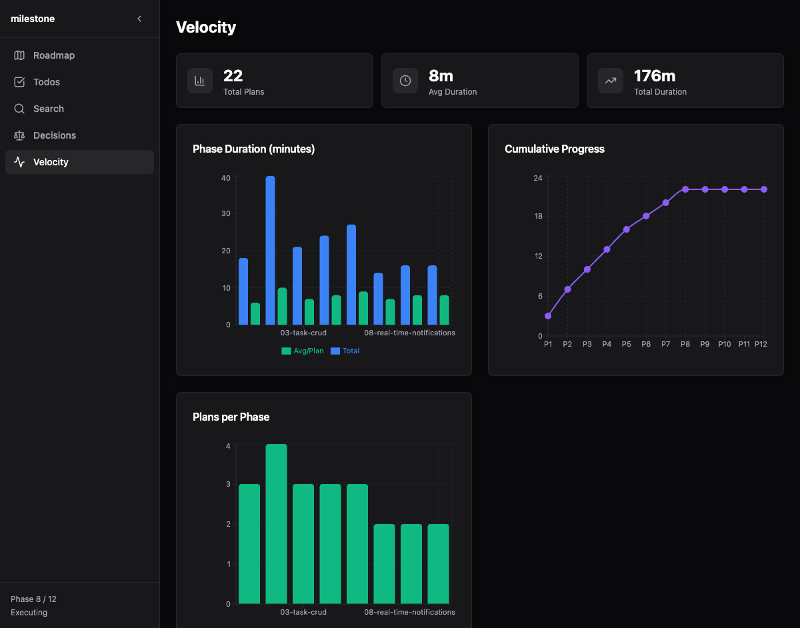

# GSD UI

A local web dashboard for visualizing [GSD (Get Shit Done)](https://github.com/daanstolk/get-shit-done) project management data. Reads your `.planning/` directory and renders an interactive UI with real-time updates as files change.



## Features

- **Roadmap overview** with milestone timeline, progress tracking, and project stats
- **Phase details** with plan cards, verification results, and supporting documents (research, context, UAT)
- **Plan view** with split layout: metadata sidebar + tabbed content (objective, tasks, context, summary)
- **Velocity charts** showing plan duration, cumulative progress, and plans per phase
- **Decision log** extracted from all plan summaries with phase filtering
- **Todo tracking** with pending/done tabs grouped by area
- **Full-text search** across all content with `Cmd+K` quick search
- **Live updates** via WebSocket — edits to `.planning/` files reflect instantly

## Screenshots

<table>
<tr>
<td width="50%">

**Phase View** — Plans grouped by wave, verification status, research docs



</td>
<td width="50%">

**Plan View** — Metadata, requirements, decisions, and execution summary



</td>
</tr>
<tr>
<td width="50%">

**Velocity** — Duration charts, cumulative progress, plans per phase



</td>
<td width="50%">

**Todos** — Pending and completed items with expandable details


</td>
</tr>
</table>

## Quick Start

**Prerequisites:** [Bun](https://bun.sh) runtime

```bash
# Clone and install
git clone https://github.com/daanstolk/gsd-ui.git
cd gsd-ui
bun install

# Build the frontend
bun run build

# Start the server (auto-detects .planning/ in current directory)
bun run server

# Or point to a specific project
bun run server/index.ts /path/to/your/project
```

Open **http://localhost:4567** in your browser.

### Development

```bash
# Terminal 1: Start the backend server
bun run server/index.ts /path/to/your/project

# Terminal 2: Start Vite dev server (with HMR)
bun run dev
```

The Vite dev server proxies `/api` and `/ws` requests to the backend on port 4567.

### Try It with Demo Data

The repo includes a demo `.planning/` directory with sample data:

```bash
bun run build
bun run server/index.ts demo
```

## How It Works

GSD UI reads a `.planning/` directory — the structured project management format created by the [GSD framework](https://github.com/daanstolk/get-shit-done). It parses all markdown files with YAML frontmatter into a structured state tree, then serves a React dashboard.

```
your-project/
  .planning/
    config.json          # Project configuration
    PROJECT.md           # Project overview
    STATE.md             # Current progress and velocity metrics
    ROADMAP.md           # Milestone definitions with phase ranges
    REQUIREMENTS.md      # Requirement traceability
    phases/
      01-feature-name/
        01-01-PLAN.md    # Plan with objective, tasks, context
        01-01-SUMMARY.md # Execution summary with decisions
        01-VERIFICATION.md
        01-RESEARCH.md
      02-another-feature/
        ...
    todos/
      pending/           # Open items
      done/              # Completed items
    research/            # Standalone research documents
```

### Architecture

```
Browser  <──WebSocket──>  Bun Server  <──chokidar──>  .planning/
         <──HTTP/API───>             (parses markdown
                                      + YAML frontmatter)
```

- **Server** (`server/`) — Bun.serve() with HTTP API + WebSocket. Parses all files on startup, watches for changes, broadcasts state updates to all connected clients.
- **Frontend** (`src/`) — React 19 SPA with Tailwind CSS 4. Receives state via WebSocket, renders 9 views with client-side routing.

### Views

| Route | View | Description |
|-------|------|-------------|
| `/` | Roadmap | Status banner, stats, milestone cards by category |
| `/milestone/:v` | Milestone | Phase cards with progress for a milestone |
| `/phase/:n` | Phase | Plans by wave, verification, research/context/UAT tabs |
| `/plan/:p/:n` | Plan | Split layout: metadata sidebar + tabbed content |
| `/todos` | Todos | Pending/done tabs, grouped by area |
| `/decisions` | Decisions | Filterable table of all decisions from summaries |
| `/velocity` | Velocity | Charts: duration, cumulative progress, plans per phase |
| `/search` | Search | Full-text search with results grouped by type |
| `/document/*` | Document | Generic markdown document viewer |

## Tech Stack

| Layer | Technology |
|-------|-----------|
| Runtime | [Bun](https://bun.sh) |
| Frontend | React 19, React Router 7, Tailwind CSS 4 |
| Charts | Recharts |
| Markdown | react-markdown + remark-gfm |
| Icons | Lucide React |
| Build | Vite 7 |
| File watching | chokidar |
| Frontmatter | gray-matter |

## API

| Endpoint | Description |
|----------|-------------|
| `GET /api/state` | Full project state (phases, milestones, todos, search index) |
| `GET /api/search?q=...` | Full-text search with relevance scoring (max 50 results) |
| `GET /api/document?path=...` | Raw markdown content of a file within `.planning/` |
| `WS /ws` | WebSocket — receives full state on connect and on file changes |

## Security

GSD UI is designed as a **local development tool**:

- Binds to `127.0.0.1` only (not accessible from other machines on the network)
- Static file serving has path traversal protection
- Document API restricted to `.planning/` directory only
- WebSocket validates Origin header to prevent cross-site hijacking
- Absolute filesystem paths are stripped from all client-facing responses
- gray-matter JS frontmatter engine is disabled (prevents code execution via crafted files)

## License

MIT
